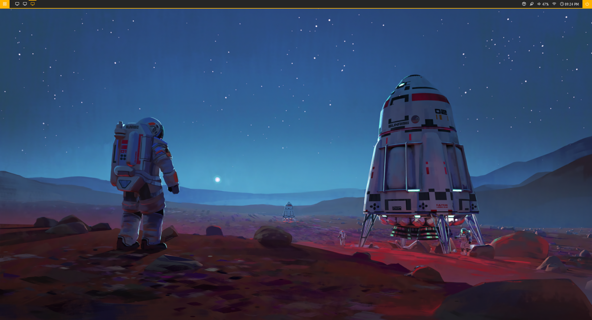
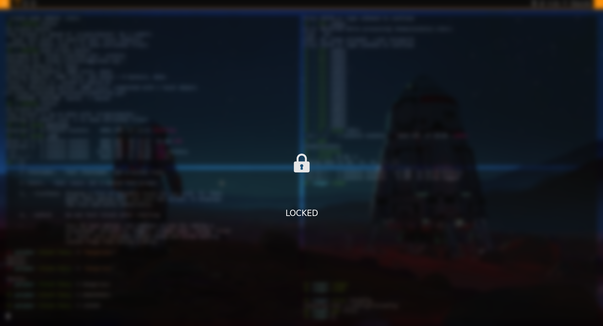

# Nce3xin's GNU/Linux dotfiles

These are my dotfiles! They are distro-independent.

## Table of Contents
- [Nce3xin's GNU/Linux dotfiles](#nce3xins-gnulinux-dotfiles)
  - [Table of Contents](#table-of-contents)
  - [Screenshot](#screenshot)
    - [Blank](#blank)
    - [Workspace](#workspace)
    - [The lock screen](#the-lock-screen)
  - [Components](#components)
    - [i3-gaps](#i3-gaps)
    - [Terminal](#terminal)
    - [Shell](#shell)
    - [Others](#others)
  - [Installation](#installation)
  - [Key Bindings](#key-bindings)
  - [More Documentation](#more-documentation)

## Screenshot
### Blank

### Workspace

### The lock screen

## Components

### i3-gaps
[i3-gaps](https://github.com/Airblader/i3) -- i3 with more features. i3-gaps is a fork of i3wm, a tiling window manager for X11. It is kept up to date with upstream, adding a few additional features such as gaps between windows.

### Terminal
- [Tilix](https://github.com/gnunn1/tilix) is used as the default terminal.

### Shell
- Throw away your bash and embrace the [zsh](https://www.zsh.org/).
- [Oh My Zsh](https://github.com/robbyrussell/oh-my-zsh). Oh My Zsh is an open source, community-driven framework for managing your zsh configuration.

### Others
- [neofetch](https://github.com/dylanaraps/neofetch). Neofetch is a command-line system information tool. Neofetch displays information about your operating system, software and hardware in an aesthetic and visually pleasing way.
- [polybar](https://github.com/jaagr/polybar). Polybar aims to help users build beautiful and highly customizable status bars for their desktop environment, without the need of having a black belt in shell scripting. A collection of polybar themes can be found here: [polybar themes](https://github.com/adi1090x/polybar-themes). I use the polybar-4 theme.
- [i3lock-fancy](https://github.com/meskarune/i3lock-fancy). This is an i3lock bash script that takes a screenshot of the desktop, blurs the background and adds a lock icon and text.
- [ranger](https://github.com/ranger/ranger). Ranger is a console file manager with VI key bindings. It provides a minimalistic and nice curses interface with a view on the directory hierarchy.
- [feh](https://github.com/derf/feh). Feh is a light-weight, configurable and versatile image viewer. Here feh is used to set the wallpaper.
- [rofi](https://github.com/davatorium/rofi). Rofi, a window switcher, application launcher and dmenu replacement.
- [visual studio code](https://code.visualstudio.com/). A well-known IDE-like editor for developers.
- [google chrome](https://www.google.com/chrome/). Needless to say, the best browser.
- [compton](https://github.com/chjj/compton). Compton is a compositor for X, supporting terminal transparency.
- [scrot](https://github.com/dreamer/scrot). Scrot (SCReen shOT) is a simple commandline screen capture utility.

## Installation
Please see [Wiki: Installation](https://github.com/nce3xin/dotfiles/wiki/Install-the-dotfiles-onto-a-new-system).

## Key Bindings
Please see [Wiki: Key Bindings](https://github.com/nce3xin/dotfiles/wiki/Key-Bindings).

## More Documentation
There is a more detailed documentation of this repository in our [Wiki](https://github.com/nce3xin/dotfiles/wiki), including how to track your dotfiles from scratch, etc.

